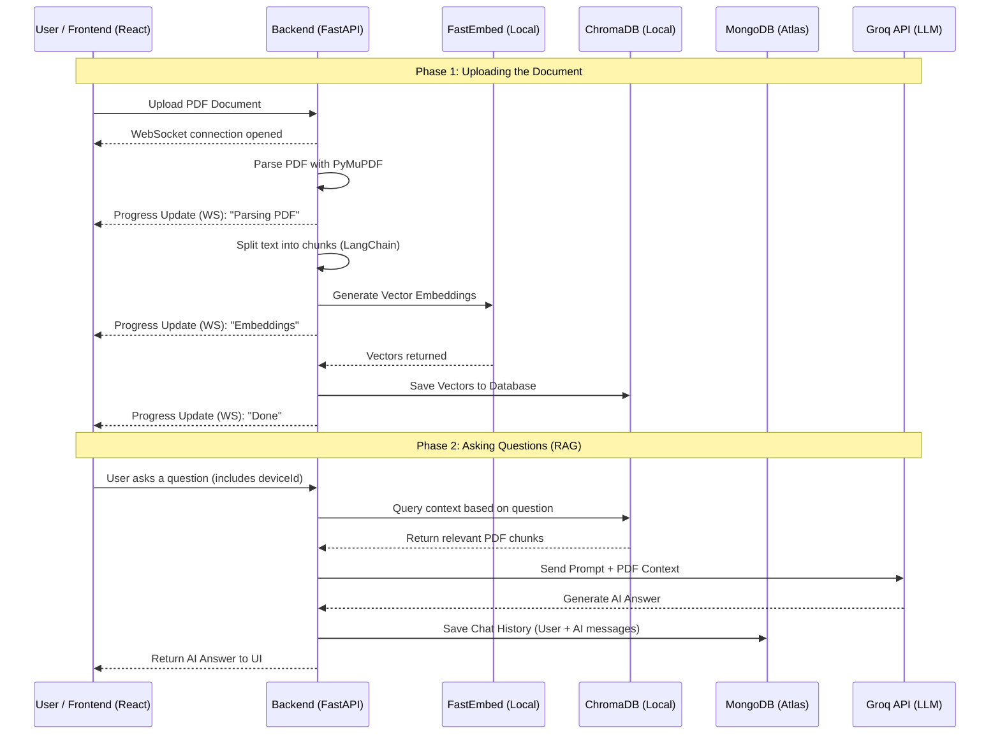

<div align="center">
  <div style="background-color: #f97316; width: 60px; height: 60px; border-radius: 12px; display: flex; align-items: center; justify-content: center; margin: 0 auto 20px;">
    <h1 style="color: white; margin: 0; font-family: sans-serif; font-size: 32px;"></h1>
  </div>
  <h1>COGNI</h1>
  <p><strong>A Local, Privacy-First RAG Document Analysis Chatbot</strong></p>
</div>

---

**Cogni** is an intelligent, full-stack Retrieval-Augmented Generation (RAG) application. It allows users to upload massive PDF documents and immediately start asking questions about them. Cogni extracts text, analyzes it, creates vector embeddings locally, and provides highly accurate, context-aware answers using the Groq LLM API.

## 🚀 Key Features

- **Anonymous Chat History**: No login required. Chat histories are saved persistently via an anonymous browser `deviceId` in MongoDB Atlas.
- **Local Vector Embeddings**: Document embeddings are generated entirely locally using `FastEmbed` and saved to a local `ChromaDB` instance, keeping processing fast and secure.
- **Real-Time Graph UI**: Watch your document get processed in real-time. The FastAPI backend streams live WebSocket updates to a dynamic, animated snake-flow graph in the React frontend.
- **Premium UI/UX**: Custom-built Vanilla CSS interface with glassmorphism, micro-animations, Lottie upload states, and a clean white-themed layout.

---

## 🏗️ Architecture & Logic Flow

Below is the high-level architecture diagram demonstrating how the Frontend, Backend, AI models, and Databases interact.



---

## 📂 Folder Structure

```text
Cogni/
├── backend/                     # Python FastAPI Backend
│   ├── main.py                  # API endpoints, WebSocket router, main server logic
│   ├── database.py              # MongoDB Atlas connection & chat history logic
│   ├── rag_pipeline.py          # PyMuPDF, LangChain, FastEmbed, and ChromaDB logic
│   ├── requirements.txt         # Python dependencies
│   ├── uploaded_files/          # Temporary storage for uploaded PDFs
│   └── chroma_db/               # Local persistent storage for Vector Embeddings
│
├── frontend/                    # React + Vite Frontend
│   ├── index.html               # Main HTML entry point
│   ├── package.json             # Node dependencies
│   ├── public/                  # Static assets
│   └── src/                     
│       ├── App.jsx              # Main App component, state routing, WS listener
│       ├── index.css            # Global CSS variables and styles
│       └── components/          # Reusable UI Components
│           ├── LeftSidebar.jsx  # Chat history list
│           ├── MainChat.jsx     # Chat interface & Lottie animations
│           └── RightSidebar.jsx # Animated snake-flow process graph
│
├── .gitignore                   # Root gitignore
└── README.md                    # This documentation file
```

---

## 💻 Tech Stack & Libraries

### Frontend
- **React.js**: UI Framework
- **Vite**: Build tool and dev server
- **Vanilla CSS**: Custom styling, CSS Grid, Flexbox, and Keyframe animations
- **@lottiefiles/dotlottie-react**: High-performance Lottie animations

### Backend
- **FastAPI**: High-performance async REST & WebSocket API framework
- **Uvicorn**: ASGI server to run FastAPI
- **Motor**: Async Python driver for MongoDB Atlas

### AI & Data Pipeline (RAG)
- **LangChain**: Orchestration framework for LLMs and document splitting
- **PyMuPDF (fitz)**: High-speed PDF text extraction
- **FastEmbed**: Lightweight, local embedding generation (no API keys needed for embeddings)
- **Groq API (`langchain-groq`)**: Ultra-fast LLM inference for generating answers
- **ChromaDB**: Open-source local vector database

---

## 🛠️ Getting Started / Local Setup

Follow these instructions to run COGNI locally on your machine.

### Prerequisites
- Node.js (v18+)
- Python (3.10+)
- A Groq API Key (You can configure this in the UI settings)
- A MongoDB Atlas connection string (or run MongoDB locally)

### 1. Clone the repository
```bash
git clone https://github.com/eesha264/COGNI.git
cd COGNI
```

### 2. Setup the Backend
Navigate to the backend directory, create a virtual environment, and install the dependencies.
```bash
cd backend
python -m venv venv
# Activate the virtual environment:
# On Windows: venv\Scripts\activate
# On Mac/Linux: source venv/bin/activate
pip install -r requirements.txt
```

Create a `.env` file in the `backend/` directory and add your MongoDB URL:
```env
MONGODB_URL=mongodb+srv://<username>:<password>@<cluster>.mongodb.net/?appName=COGNI
```

Start the backend server:
```bash
uvicorn main:app --reload --port 8000
```

### 3. Setup the Frontend
Open a new terminal, navigate to the frontend directory, install dependencies, and start the Vite server.
```bash
cd frontend
npm install
npm run dev
```

### 4. Use the App
Open your browser and navigate to `http://localhost:5174` (or whatever port Vite provides). 
1. Click the **Settings** gear in the left sidebar and enter your **Groq API Key**.
2. Click the dashed **Upload PDF** box in the right sidebar.
3. Watch the graph animate, and start chatting with your document!


