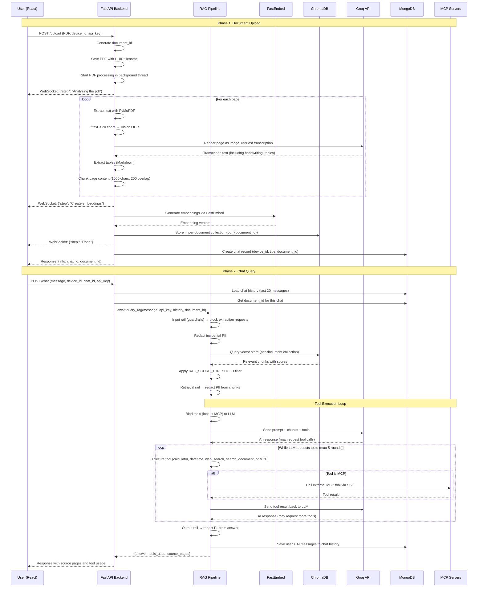

# COGNI Architecture

A comprehensive architecture document for the COGNI full-stack Retrieval-Augmented Generation (RAG) application.

---

## Table of Contents

1. [Overview](#1-overview)
2. [System Architecture](#2-system-architecture)
3. [Backend Architecture](#3-backend-architecture)
4. [Frontend Architecture](#4-frontend-architecture)
5. [Data Flow](#5-data-flow)
6. [Security & Privacy Architecture](#6-security--privacy-architecture)
7. [MCP Integration Architecture](#7-mcp-integration-architecture)
8. [API Contract](#8-api-contract)
9. [Environment Variables](#9-environment-variables)
10. [Deployment Considerations](#10-deployment-considerations)

---

## 1. Overview

COGNI is a full-stack Retrieval-Augmented Generation (RAG) application that enables users to upload PDF documents and ask questions about them. The system extracts text, generates local vector embeddings, stores them in ChromaDB, and uses the Groq LLM API to provide accurate, context-aware answers grounded in the document content.

### Key Characteristics

- **Local-first**: Vector embeddings are generated entirely locally using FastEmbed, keeping document content off third-party embedding APIs
- **Privacy-focused**: Built-in PII detection and redaction using Presidio, with input/output guardrails
- **Anonymous**: No user accounts required — chat history is persisted via anonymous device IDs
- **Real-time**: WebSocket-based progress streaming during PDF processing
- **Extensible**: MCP integration allows consuming tools from external servers
- **Production-ready**: Comprehensive test suite (278+ tests), per-document vector collections, and graceful degradation

### Technology Stack

| Layer | Technology | Purpose |
|-------|-----------|---------|
| **Frontend** | React + Vite | User interface, chat UI, progress visualization |
| **Backend** | FastAPI + Uvicorn | REST API, WebSocket server, async request handling |
| **LLM** | Groq API | Ultra-fast LLM inference for responses and vision OCR |
| **Vector DB** | ChromaDB | Local storage of document embeddings |
| **Chat DB** | MongoDB (Motor) | Async chat history persistence |
| **PDF Parsing** | PyMuPDF (fitz) | Text, table, and image extraction from PDFs |
| **Embeddings** | FastEmbed | Local embedding generation (BAAI/bge-small-en-v1.5) |
| **Privacy** | Presidio | PII detection and redaction |
| **MCP** | langchain-mcp-adapters | External tool server integration |

---

## 2. System Architecture

### High-Level Component Diagram

```
┌─────────────────────────────────────────────────────────────────────────┐
│                              User Interface                              │
│                           (React + Vite)                                │
└──────────────────────────────┬──────────────────────────────────────────┘
                               │
                    HTTP / WebSocket
                               │
┌──────────────────────────────▼──────────────────────────────────────────┐
│                         FastAPI Backend                                 │
│                                                                          │
│  ┌────────────────────────────────────────────────────────────────────┐  │
│  │                    Request Router & Middleware                      │  │
│  │  • CORS management (ALLOWED_ORIGINS)                               │  │
│  │  • Upload size limits (MAX_UPLOAD_BYTES)                            │  │
│  │  • Device ID validation                                             │  │
│  └──────────────────────────────┬───────────────────────────────────────┘  │
│                                 │                                        │
│  ┌────────────────────────────┼───────────────────────────────────────┐  │
│  │                            │                                       │  │
│  │  ┌───────────────────────┐ │  ┌───────────────────────────────┐  │  │
│  │  │   REST Endpoints      │ │  │   WebSocket Handler          │  │  │
│  │  │   • /upload           │ │  │   • /ws/process              │  │  │
│  │  │   • /chat             │ │  │   • Device-scoped broadcasts   │  │  │
│  │  │   • /chats/{device_id}│ │  │                               │  │  │
│  │  │   • /chat/{chat_id}   │ │  │                               │  │  │
│  │  │   • /chat (DELETE)    │ │  │                               │  │  │
│  │  └───────────────────────┘ │  └───────────────────────────────┘  │  │
│  │                            │                                       │  │
│  └────────────────────────────┼───────────────────────────────────────┘  │
│                                 │                                        │
│  ┌────────────────────────────▼───────────────────────────────────────┐  │
│  │                    Core Business Logic                              │  │
│  │                                                                        │  │
│  │  ┌──────────────────┐  ┌──────────────────┐  ┌─────────────────┐  │  │
│  │  │  PDF Processing  │  │  RAG Pipeline     │  │  MCP Manager    │  │  │
│  │  │  • PyMuPDF       │  │  • Query Logic    │  │  • SSE Client    │  │  │
│  │  │  • Vision OCR     │  │  • Tool Calling   │  │  • Tool Loading  │  │  │
│  │  │  • Table Extract  │  │  • Prompt Engine  │  │  • Lifecycle     │  │  │
│  │  └──────────────────┘  └──────────────────┘  └─────────────────┘  │  │
│  │                                                                        │  │
│  │  ┌──────────────────┐  ┌──────────────────┐  ┌─────────────────┐  │  │
│  │  │  Privacy Layer   │  │  Database Layer   │  │  Cache Layer     │  │  │
│  │  │  • Input Rail     │  │  • MongoDB        │  │  • Vector Store  │  │  │
│  │  │  • Output Rail    │  │  • Device ID      │  │  • Web Search    │  │  │
│  │  │  • PII Guard      │  │  • Chat History   │  │  • Embeddings    │  │  │
│  │  └──────────────────┘  └──────────────────┘  └─────────────────┘  │  │
│  └──────────────────────────────────────────────────────────────────────┘  │
└─────────────────────────────────────────────────────────────────────────┘
                                 │
                    ┌────────────┼────────────┐
                    │            │            │
            ┌───────▼─────┐ ┌───▼──────┐ ┌───▼──────┐
            │  ChromaDB   │ │ MongoDB  │ │  Groq API│
            │  (Local)    │ │ (Atlas)  │ │ (LLM)    │
            └─────────────┘ └──────────┘ └──────────┘
                               │
                    ┌──────────┼──────────┐
                    │          │          │
            ┌───────▼─────┐ ┌───▼──────┐ ┌───▼──────┐
            │  MCP Server │ │  MCP     │ │  Tavily  │
            │  (External) │ │  Server B│ │  API     │
            └─────────────┘ └──────────┘ └──────────┘
```

### Mermaid Sequence Diagram: End-to-End Flow



---

## 3. Backend Architecture

### Component Overview

```
backend/
├── main.py                  # FastAPI app, endpoints, WebSocket handler
├── rag_pipeline.py          # RAG logic, tool calling, PDF processing
├── database.py              # MongoDB chat history, device ownership
├── guardrails.py            # Privacy input rail (blocks extraction requests)
├── pii_guard.py             # PII detection & redaction (Presidio)
├── mcp_client_manager.py    # MCP client (external tool integration)
└── requirements.txt         # Python dependencies
```

### 3.1 FastAPI Application (main.py)

#### Endpoint Architecture

| Endpoint | Method | Purpose | Key Logic |
|----------|--------|---------|-----------|
| `/upload` | POST | Upload PDF and start processing | UUID-based filename, size cap, vision OCR, per-document collection |
| `/chat` | POST | Send question, get AI answer | Async query_rag, tool calling, chat history, source attribution |
| `/chats/{device_id}` | GET | List recent chats for a device | Pagination, device ownership check |
| `/chat/{chat_id}` | GET | Load chat history | Device ownership check, message serialization |
| `/chat/{chat_id}` | DELETE | Delete a chat | Device ownership check, vector store cleanup |
| `/ws/process` | WebSocket | Stream upload progress | Device-scoped broadcasts, connection lifecycle |
| `/` | GET | Serve React app (SPA routing) | Static file serving, catchall for frontend routes |

#### WebSocket Architecture

```python
class ConnectionManager:
    connections_by_device: dict[str, list[WebSocket]]
    
    async def connect(websocket, device_id)
    async def disconnect(websocket, device_id)
    async def broadcast(message, device_id)  # Scoped per device
```

**Key design decisions:**
- Device-scoped broadcasts: users only see their own upload progress
- No global broadcast: prevents cross-user information leakage
- Graceful connection failure handling: closed sockets are removed automatically

#### CORS Configuration

```python
ALLOWED_ORIGINS = [
    o.strip() for o in os.getenv(
        "ALLOWED_ORIGINS",
        "http://localhost:5173,http://localhost:5174"
    ).split(",") if o.strip()
]
```

- Rejects wildcard origins (`*`) when credentials are enabled
- Configurable via environment variable
- Defaults to local development origins

### 3.2 RAG Pipeline (rag_pipeline.py)

#### PDF Processing Flow

```
PDF Upload
    ↓
UUID-based filename (path traversal protection)
    ↓
Size cap streaming (100 MB default, configurable)
    ↓
Content-type validation (application/pdf, application/octet-stream)
    ↓
Per-page processing loop:
    ├─ Extract digital text (PyMuPDF)
    ├─ If text < 20 chars → Check for images
    │   ├─ No images → Skip (blank page)
    │   └─ Has images → Vision OCR (Groq vision model)
    ├─ Extract tables (PyMuPDF → Markdown)
    └─ Chunk content (1000 chars, 200 overlap, page metadata)
    ↓
Create embeddings (FastEmbed, BAAI/bge-small-en-v1.5)
    ↓
Store in per-document Chroma collection (pdf_{document_id})
    ↓
Return: {status, chunks_processed, document_id}
```

**Key features:**
- Per-document collections: uploading a new PDF doesn't wipe previous ones
- Vision OCR fallback: scanned/handwritten pages are transcribed
- Table extraction: structured tables converted to Markdown
- Blank page detection: skips vision calls on truly empty pages
- Page limit: rejects PDFs longer than 400 pages

#### Tool Calling Architecture

```python
AVAILABLE_TOOLS = [calculator, get_current_datetime]
query_rag builds:
    - Local tools: AVAILABLE_TOOLS + [search_document, web_search]
    - MCP tools: from external servers (via get_mcp_tools())
    - Binds all to LLM: llm.bind_tools(call_tools)
```

**Tool definitions:**

| Tool | Purpose | State |
|------|---------|-------|
| `calculator` | Evaluate arithmetic expressions | Stateless |
| `get_current_datetime` | Return server date/time | Stateless |
| `web_search` | Search live web via Tavily API | Per-conversation budget (max 5) |
| `search_document` | Query uploaded document | Stateful (per-document vector store) |
| MCP tools | External server tools | Stateful (per server connection) |

**Tool execution loop:**
```python
max_tool_rounds = 5
while LLM requests tools and rounds < max_tool_rounds:
    for each tool call:
        - Validate args (must be dict)
        - Execute tool (await tool_fn.ainvoke(args))
        - Send result back to LLM
    rounds += 1

if max rounds exceeded:
    - Final invoke WITHOUT tools bound (force text answer)
```

#### Privacy Guardrails Integration

```python
# Input rail (guardrails.py)
question → input_rail(question) → allowed/redacted query

# Retrieval rail (rag_pipeline.py)
chunks → redact_pii(chunks, RAIL_ENTITIES) → sanitized chunks

# Output rail (rag_pipeline.py)
answer → redact_pii(answer, RAIL_ENTITIES) → sanitized answer
```

**RAIL_ENTITIES (high-confidence, low false-positive):**
- EMAIL_ADDRESS
- PHONE_NUMBER
- CREDIT_CARD
- US_SSN
- IBAN_CODE
- IN_PAN
- IN_AADHAAR

**Excluded from rails (too many false positives):**
- PERSON (names appear in ordinary questions)
- LOCATION (places appear in ordinary questions)
- DATE_TIME (dates appear in ordinary questions)

### 3.3 Database Layer (database.py)

#### MongoDB Schema

```javascript
{
  _id: ObjectId,
  device_id: String,           // Anonymous user identifier
  title: String,               // First 30 chars of initial message
  created_at: DateTime (UTC),  // Timezone-aware
  document_id: String?,        // Per-document collection ID
  messages: [
    {
      role: "user" | "ai",
      content: String,
      timestamp: DateTime (UTC),
      tools_used: [String]?,   // Tool names used
      source_pages: [Number]?, // Page numbers cited
      tool_calls: [Object]?,   // Tool call context (H9 fix)
      tool_call_id: String?    // For ToolMessage replay (H9 fix)
    }
  ]
}
```

#### Key Operations

| Operation | Function | Ownership Check |
|-----------|---------|-----------------|
| `create_chat` | Create new chat record | N/A (new record) |
| `get_chat_document_id` | Get document_id for RAG lookup | Yes (device_id comparison) |
| `add_message` | Append message to chat | N/A (chat_id validated) |
| `get_chats` | List chats for device | Yes (query filtered by device_id) |
| `get_chat_history` | Load messages for chat | Yes (device_id comparison) |
| `delete_chat` | Delete chat record | Yes (query filtered by device_id) |

#### Safety Features

- **`_to_objectid` helper**: Validates chat_id, returns None for malformed IDs (no 500 on invalid IDs)
- **Graceful degradation**: If `MONGODB_URI` is not set, all DB operations return empty/None silently
- **Timezone-aware datetime**: Uses `datetime.now(timezone.utc)` (deprecated `utc.utcnow()` removed)

### 3.4 Privacy Layer

#### Input Rail (guardrails.py)

**Blocked patterns:**
- Token reveal attempts: "reveal [EMAIL_001]", "unmask [PHONE_002]"
- System-scope requests: "all customers", "the database", "every user"
- Bank details queries: "customers bank details"
- Bulk PII + system scope: "all emails in the database"

**Response:**
- Blocked → `"I can't help with that — this request looks like it's asking for bulk or unmasked sensitive data."`
- Allowed → Redacted query (incidental PII replaced with placeholders like `[EMAIL_001]`)

#### PII Guard (pii_guard.py)

**Presidio-based detection:**
- SpaCy NLP engine (en_core_web_sm)
- India-specific recognizers: PAN, Aadhaar
- Standard recognizers: Email, Phone, Credit Card, SSN, IBAN
- Overlap resolution: highest score wins, then longest span, then earliest start

**Token store:**
- Maps placeholder tokens to original values
- Per-call in-memory store (future: encrypted DB-backed store)
- Stable placeholders: `[EMAIL_001]`, `[PHONE_002]`, etc.

### 3.5 MCP Client Manager (mcp_client_manager.py)

#### Connection Lifecycle

```
Startup:
  ├─ Read MCP_SERVER_URLS from env
  ├─ For each URL:
  │   ├─ Open SSE transport (sse_client)
  │   ├─ Create ClientSession
  │   ├─ MCP handshake (session.initialize)
  │   ├─ Load tools (load_mcp_tools)
  │   └─ Store in _mcp_tools + _mcp_connections
  └─ On failure: log warning, clean up partial connection

Runtime:
  └─ get_mcp_tools() returns list[BaseTool] for query_rag

Shutdown:
  ├─ For each connection:
  │   ├─ Close session (__aexit__)
  │   └─ Close transport (__aexit__)
  └─ Clear tool and connection lists
```

#### Error Handling

- **Unreachable server**: Logged as warning, skipped — app continues with local tools
- **Partial failure**: If transport opens but session/tool loading fails, transport is explicitly closed (prevents leaks)
- **No servers configured**: Returns empty list, app works with local tools only

---

## 4. Frontend Architecture

### Component Structure

```
frontend/src/
├── App.jsx                  # Main app component, device ID management, WebSocket
├── main.jsx                 # React entry point
├── config.js                # Backend URL configuration
├── constants.js             # Shared step labels for progress graph
└── components/
    ├── LeftSidebar.jsx      # Chat history list, new chat, settings button
    ├── MainChat.jsx         # Chat interface, message rendering, copy button
    ├── RightSidebar.jsx     # Animated process graph, file upload
    ├── SettingsModal.jsx    # API key configuration (sessionStorage)
    └── MarkdownRenderer.jsx # Lazy-loaded Markdown + math + code rendering
```

### State Management

| State | Storage | Purpose |
|-------|---------|---------|
| `apiKey` | sessionStorage | Groq API key (cleared on tab close) |
| `deviceId` | localStorage | Anonymous user identifier (persists across sessions) |
| `chats` | React state | List of recent chats (fetched from backend) |
| `activeChatId` | React state | Currently selected chat |
| `messages` | React state | Messages in current chat |
| `activeStep` | React state | Current PDF processing step (from WebSocket) |
| `isUploading` | React state | Upload in progress flag |

### WebSocket Integration

```javascript
// Connection
const ws = new WebSocket(`${WS_BASE_URL}/ws/process?device_id=${deviceId}`);
ws.onmessage = (event) => {
  const data = JSON.parse(event.data);
  if (data.step) setActiveStep(data.step);
  if (data.error) alert("Error: " + data.error);
};
```

**Device ID requirement:**
- Backend rejects connections without `device_id` query param
- Frontend always includes it
- Ensures broadcasts are scoped per user

### Markdown Rendering Architecture

```
AI response
    ↓
normalizeLatexDelimiters()
    ├─ Split on fenced code blocks (```...```)
    ├─ Split on inline code spans (`...`)
    └─ Convert \[ \] \( \) to $$ $ $ (outside code)
    ↓
ReactMarkdown
    ├─ remarkGfm (GitHub Flavored Markdown)
    ├─ remarkMath (LaTeX delimiters)
    ├─ rehypeRaw (parse model-generated HTML like <br>)
    ├─ rehypeSanitize (strip unsafe HTML)
    ├─ rehypeKatex (render math with KaTeX)
    └─ rehypeHighlight (syntax highlight code)
    ↓
Rendered HTML with:
    - Tables, lists, links
    - Math ($...$, $$...$$)
    - Syntax-highlighted code blocks
    - Safe HTML (no scripts, event handlers)
```

**Sanitization schema:**
- Allows `<br>` for table cell line breaks
- Allow-lists `className` values for math rendering only
- Strips all other HTML tags and attributes

### Lazy Loading

`MarkdownRenderer` is loaded via `React.lazy()` to reduce initial bundle size:
```javascript
const MarkdownRenderer = lazy(() => import('./MarkdownRenderer'));
// Suspense fallback shows plain text while loading
```

---

## 5. Data Flow

### 5.1 Document Upload Flow

```
User selects PDF
    ↓
Frontend: FormData {file, device_id, api_key}
    ↓
POST /upload
    ↓
Backend validation:
    ├─ Filename ends with .pdf?
    ├─ Content-type valid?
    └─ Size < MAX_UPLOAD_BYTES?
    ↓
Save with UUID filename (path traversal protection)
    ↓
Background thread: run_pdf_processing()
    ↓
WebSocket progress updates (scoped per device_id)
    ↓
Process per page:
    ├─ Extract text (PyMuPDF)
    ├─ Vision OCR if needed (Groq vision model)
    ├─ Extract tables (Markdown)
    └─ Chunk (1000 chars, 200 overlap, page metadata)
    ↓
Create embeddings (FastEmbed)
    ↓
Store in ChromaDB (pdf_{document_id})
    ↓
Create chat record (MongoDB)
    ↓
Return: {info, chat_id, document_id}
```

### 5.2 Chat Query Flow

```
User sends message
    ↓
Frontend: FormData {message, api_key, device_id, chat_id}
    ↓
POST /chat
    ↓
Load chat history (MongoDB, last 20 messages)
    ↓
Get document_id for this chat (MongoDB)
    ↓
await query_rag(message, api_key, history, document_id)
    ↓
Input rail (guardrails): block extraction attempts
    ↓
Redact incidental PII from question
    ↓
Query vector store (ChromaDB, pdf_{document_id})
    ↓
Filter by RAG_SCORE_THRESHOLD
    ↓
Retrieval rail: redact PII from chunks
    ↓
Bind tools (local + MCP) to LLM
    ↓
Tool execution loop (max 5 rounds):
    ├─ Calculator (local)
    ├─ Datetime (local)
    ├─ Web search (Tavily, per-conversation budget)
    ├─ Search document (ChromaDB)
    └─ MCP tools (external servers via SSE)
    ↓
Output rail: redact PII from answer
    ↓
Save user + AI messages (MongoDB)
    ↓
Return: {answer, tools_used, source_pages}
```

### 5.3 Privacy Data Flow

```
User question
    ↓
Input rail (guardrails.py)
    ├─ Check for token reveal patterns
    ├─ Check for system-scope patterns
    ├─ Check for bank details queries
    └─ Check for bulk PII + system scope
    ↓
If blocked → Return refusal message
If allowed → Continue
    ↓
PII Guard (pii_guard.py)
    ├─ Detect PII entities (Presidio)
    ├─ Resolve overlaps (highest score wins)
    ├─ Replace with placeholders ([EMAIL_001], etc.)
    └─ Store original values in TokenStore
    ↓
Redacted question → LLM
    ↓
LLM response
    ↓
Output rail (PII Guard)
    ├─ Detect PII entities
    ├─ Replace with placeholders
    └─ Return redacted answer
```

---

## 6. Security & Privacy Architecture

### 6.1 Security Measures

| Threat | Mitigation |
|--------|------------|
| **Path traversal via filename** | UUID-based filenames (e.g., `abc123.pdf`), original name preserved for display only |
| **Oversized upload DoS** | Streaming with size cap (100 MB default), partial file cleanup on exceed |
| **Non-PDF file upload** | Extension check (`.pdf`) + content-type validation |
| **Cross-origin attacks** | Restricted CORS origins (configurable via `ALLOWED_ORIGINS`) |
| **Chat access by unauthorized users** | Device-based ownership checks on all chat endpoints |
| **Malformed chat_id 500 errors** | `_to_objectid` helper returns None for invalid IDs (graceful) |
| **Injection via tool arguments** | Tool args validated as dict before invocation |
| **Web search quota abuse** | Per-conversation budget (max 5 calls) |
| **Malicious HTML in LLM output** | `rehype-sanitize` strips scripts, event handlers, iframes |

### 6.2 Privacy Measures

| PII Type | Detection | Redaction | Scope |
|----------|-----------|-----------|-------|
| Email addresses | Presidio EMAIL_ADDRESS | Placeholder `[EMAIL_XXX]` | Input, retrieval, output rails |
| Phone numbers | Presidio PHONE_NUMBER | Placeholder `[PHONE_XXX]` | Input, retrieval, output rails |
| Credit cards | Presidio CREDIT_CARD | Placeholder `[CREDIT_CARD_XXX]` | Input, retrieval, output rails |
| US SSN | Presidio US_SSN | Placeholder `[US_SSN_XXX]` | Input, retrieval, output rails |
| IBAN codes | Presidio IBAN_CODE | Placeholder `[IBAN_CODE_XXX]` | Input, retrieval, output rails |
| PAN (India) | Custom regex | Placeholder `[IN_PAN_XXX]` | Input, retrieval, output rails |
| Aadhaar (India) | Custom regex | Placeholder `[IN_AADHAAR_XXX]` | Input, retrieval, output rails |

**Guardrails:**
- **Input rail**: Blocks requests that try to extract or unmask sensitive data
- **Retrieval rail**: Redacts PII from document chunks before LLM sees them
- **Output rail**: Redacts PII from LLM responses before user sees them

### 6.3 Data Storage

| Data | Storage | Persistence | Encryption |
|------|---------|-------------|------------|
| Chat history | MongoDB Atlas | Persistent | Application-level (device_id as key) |
| Vector embeddings | ChromaDB (local) | Persistent | None (local file system) |
| Uploaded PDFs | `uploaded_files/` (local) | Temporary (until processed) | None |
| API keys | Frontend sessionStorage | Session (cleared on tab close) | HTTPS in transit |
| Device ID | Frontend localStorage | Persistent | None (anonymous identifier) |

---

## 7. MCP Integration Architecture

### 7.1 MCP Component Diagram

```
┌──────────────────────────────────────────────────────────────────┐
│                    MCP Client Manager                             │
│                   (mcp_client_manager.py)                           │
├──────────────────────────────────────────────────────────────────┤
│                                                                  │
│  Global State:                                                    │
│  • _mcp_tools: list[BaseTool] (from external servers)             │
│  • _mcp_connections: list[dict] (transport + session)            │
│                                                                  │
│  API:                                                             │
│  • get_mcp_tools() → list[BaseTool]                              │
│  • await connect_mcp_servers() → void                             │
│  • await disconnect_mcp_servers() → void                           │
└──────────────────────────────────────────────────────────────────┘
                               │
                    SSE / HTTP transport
                               │
              ┌────────────────┼────────────────┐
              ▼                ▼                ▼
┌──────────────────┐ ┌──────────────────┐ ┌──────────────────┐
│  MCP Server A    │ │  MCP Server B    │ │  MCP Server C    │
│  (e.g. GitHub)   │ │  (e.g. Filesystem)│ │  (e.g. custom)  │
│                  │ │                  │ │                  │
│  Tools:          │ │  Tools:          │ │  Tools:          │
│   list_repos     │ │   read_file      │ │   greet          │
│   create_issue   │ │   write_file     │ │   ...            │
│   ...            │ │   ...            │ │                  │
└──────────────────┘ └──────────────────┘ └──────────────────┘
```

### 7.2 Tool Merging in query_rag

```python
# Local tools (in-process, stateful)
local_tools = [calculator, get_current_datetime, search_document, web_search]

# MCP tools (external, stateless per call)
mcp_tools = get_mcp_tools()  # [] if no servers configured

# Merge and bind
all_tools = local_tools + mcp_tools
tools_by_name = {
    **_TOOLS_BY_NAME,           # Local tool registry
    "search_document": search_document,
    "web_search": web_search,
    **{t.name: t for t in mcp_tools},  # MCP tools
}

llm_with_tools = llm.bind_tools(all_tools)
```

**Tool name collision handling:**
- If an MCP tool has the same name as a local tool, the MCP version overwrites it
- Current implementation: no warning, last one wins
- Future improvement: log warning and skip conflicting MCP tool

### 7.3 Async Conversion Rationale

**Before (sync):**
```python
# query_rag was synchronous
result = await asyncio.to_thread(query_rag, ...)
```

**After (async):**
```python
# query_rag is async (to await MCP tool calls)
result = await query_rag(...)
```

**Why:**
- MCP's `ClientSession` is async-only
- Can't call async code from sync without nested event loops (fragile, deadlock-prone)
- `.ainvoke()` works for both sync and async tools (LangChain wraps sync tools)

---

## 8. API Contract

### 8.1 REST Endpoints

| Method | Endpoint | Parameters | Returns | Error Codes |
|--------|----------|------------|---------|-------------|
| `POST` | `/upload` | `file` (PDF), `device_id` (required), `api_key` (optional) | `{info, chat_id, document_id}` | 400 (invalid file), 413 (too large) |
| `POST` | `/chat` | `message` (required), `api_key` (optional), `device_id` (required), `chat_id` (optional) | `{response, chat_id, tools_used, source_pages, db_warning?}` | 400 (missing key) |
| `GET` | `/chats/{device_id}` | `page` (optional, default 1), `per_page` (optional, default 50) | `{chats: [{id, title, created_at}], page, per_page, has_more}` | 200 |
| `GET` | `/chat/{chat_id}` | `device_id` (query, required) | `{messages: [{role, content, timestamp}]}` | 404 (not found, wrong device) |
| `DELETE` | `/chat/{chat_id}` | `device_id` (query, required) | `{message}` | 404 (not found, wrong device) |
| `GET` | `/` | — | React index.html | 404 (no build) |
| `GET` | `/{catchall:path}` | — | Static file or index.html | 404 (no build) |

### 8.2 WebSocket Endpoint

| Endpoint | Parameters | Messages |
|----------|------------|----------|
| `WS /ws/process` | `device_id` (query, required) | `{step: string}` or `{error: string}` |

**Message types:**
- `step`: Processing step name (matches PROCESS_STEPS in frontend)
- `error`: Error message if processing fails

### 8.3 Response Formats

#### Upload Response
```json
{
  "info": "file 'document.pdf' uploaded and processing started.",
  "chat_id": "507f1f77bcf86cd799439011",
  "document_id": "abc123def456"
}
```

#### Chat Response
```json
{
  "response": "The answer is 42.",
  "chat_id": "507f1f77bcf86cd799439011",
  "tools_used": ["calculator"],
  "source_pages": [5, 12],
  "db_warning": "Chat history is not being saved (database unavailable)."
}
```

#### Chats Response
```json
{
  "chats": [
    {
      "id": "507f1f77bcf86cd799439011",
      "title": "Document: document.pdf",
      "created_at": "2024-08-25T10:30:00Z"
    }
  ],
  "page": 1,
  "per_page": 50,
  "has_more": false
}
```

---

## 9. Environment Variables

| Variable | Required | Default | Description |
|----------|----------|---------|-------------|
| **Backend** | | | |
| `MONGODB_URI` | No | — | MongoDB connection string. If absent, chat history won't persist. |
| `GROQ_API_KEY` | No | — | Server-side Groq key. Can also be provided per-request from the UI. |
| `GROQ_MODEL` | No | `llama-3.3-70b-versatile` | Groq LLM model for chat responses. |
| `GROQ_VISION_MODEL` | No | `qwen/qwen3.6-27b` | Groq vision model for scanned PDF OCR. |
| `TAVILY_API_KEY` | No | — | Tavily API key for the `web_search` tool. |
| `ALLOWED_ORIGINS` | No | `localhost:5173,5174` | Comma-separated CORS origins. |
| `MAX_UPLOAD_BYTES` | No | `104857600` (100 MB) | Max upload file size in bytes. |
| `RAG_SCORE_THRESHOLD` | No | `1.0` | Max L2 distance for relevant search results. |
| `MCP_SERVER_URLS` | No | (empty) | Comma-separated SSE endpoints of external MCP servers. |
| **Frontend** | | | |
| `VITE_API_BASE_URL` | No | `http://127.0.0.1:8000` | Backend API URL for frontend. |
| `VITE_WS_BASE_URL` | No | `ws://127.0.0.1:8000` | WebSocket URL for frontend. |

---

## 10. Deployment Considerations

### 10.1 Production Checklist

- [ ] Set `ALLOWED_ORIGINS` to production frontend domain
- [ ] Set `GROQ_API_KEY` in backend environment (or require from UI)
- [ ] Set `MONGODB_URI` to production MongoDB Atlas cluster
- [ ] Set `TAVILY_API_KEY` for web search functionality
- [ ] Configure reverse proxy (nginx/Caddy) with HTTPS
- [ ] Set `MAX_UPLOAD_BYTES` appropriately for server capacity
- [ ] Configure MCP_SERVER_URLS if using external tool servers
- [ ] Run frontend in production mode (`npm run build`, serve static files)
- [ ] Set process manager (systemd, supervisor) for backend
- [ ] Configure logging (file-based, rotation)

### 10.2 Reverse Proxy Configuration (nginx)

```nginx
server {
    listen 443 ssl http2;
    server_name your-domain.com;

    ssl_certificate /path/to/cert.pem;
    ssl_certificate_key /path/to/key.pem;

    location / {
        proxy_pass http://127.0.0.1:8000;
        proxy_http_version 1.1;
        proxy_set_header Upgrade $http_upgrade;
        proxy_set_header Connection "upgrade";
        proxy_set_header Host $host;
        proxy_set_header X-Real-IP $remote_addr;
        proxy_set_header X-Forwarded-For $proxy_add_x_forwarded_for;
        proxy_set_header X-Forwarded-Proto $scheme;
    }
}
```

### 10.3 Scaling Considerations

| Component | Scaling Strategy |
|-----------|-----------------|
| **FastAPI** | Horizontal scaling via load balancer (stateless, shared ChromaDB/MongoDB) |
| **ChromaDB** | Persistent local storage — not distributed; each instance reads same `chroma_db` |
| **MongoDB** | Use MongoDB Atlas (managed, automatically scales) |
| **WebSocket** | Sticky sessions required if scaling horizontally (same device ID must hit same instance) |
| **MCP connections** | Each instance connects independently; no shared state |

### 10.4 Monitoring

Key metrics to monitor:
- Request latency (per endpoint)
- Tool call success rates (calculator, web_search, MCP tools)
- WebSocket connection health
- ChromaDB query performance
- MongoDB connection pool health
- Memory usage (vector store cache, MCP connections)

---

## Appendix A: File Inventory

### Backend Files (14 tracked)

| File | Lines | Purpose |
|------|-------|---------|
| `main.py` | 310 | FastAPI app, endpoints, WebSocket handler |
| `rag_pipeline.py` | 537 | RAG logic, tool calling, PDF processing |
| `database.py` | 161 | MongoDB chat history, device ownership |
| `guardrails.py` | 98 | Privacy input rail (blocks extraction) |
| `pii_guard.py` | 158 | PII detection & redaction (Presidio) |
| `mcp_client_manager.py` | 116 | MCP client (external tool integration) |
| `test_critical_fixes.py` | 563 | Tests for critical security bugs |
| `test_high_fixes.py` | 260 | Tests for high-severity fixes |
| `test_medium_fixes.py` | 405 | Tests for medium-severity fixes |
| `test_low_fixes.py` | 62 | Tests for low-severity fixes |
| `test_guardrails.py` | 76 | Tests for privacy guardrails |
| `test_pii_guard.py` | 74 | Tests for PII redaction |
| `test_process.py` | 23 | Tests for PDF processing |
| `test_mcp_server.py` | 12 | Minimal MCP server for manual testing |

### Frontend Files (13 tracked)

| File | Purpose |
|------|---------|
| `App.jsx` | Main app component, device ID, WebSocket |
| `main.jsx` | React entry point |
| `config.js` | Backend URL configuration |
| `constants.js` | Shared step labels for progress graph |
| `components/LeftSidebar.jsx` | Chat history list |
| `components/MainChat.jsx` | Chat interface, message rendering |
| `components/RightSidebar.jsx` | Animated process graph |
| `components/SettingsModal.jsx` | API key configuration |
| `components/MarkdownRenderer.jsx` | Markdown + math + code rendering |
| `index.css` | Global CSS |
| `App.css` | App-specific CSS |
| `LeftSidebar.css` | Sidebar styles |
| `MainChat.css` | Chat styles |
| `RightSidebar.css` | Progress graph styles |

---

## Appendix B: Test Coverage

| Test Suite | Tests | Coverage |
|------------|-------|----------|
| Critical fixes | 90 | Path traversal, CORS, auth, WebSocket, PDF limits |
| High fixes | 60 | Event loop, DB errors, model decommission, tool loops |
| Medium fixes | 88 | Pagination, caching, score threshold, datetime TZ |
| Low fixes | 40 | Device ID collision, logging, session storage |
| Guardrails | 10+ | Input rail blocking, PII redaction |
| PII Guard | 8+ | Entity detection, overlap resolution |
| Process | 1 | PDF processing pipeline |
| **Total** | **278+** | **Comprehensive** |

---

*Document version: 2.0*  
*Last updated: 2025-08-25*  
*MCP integration added: 2025-08-25*
